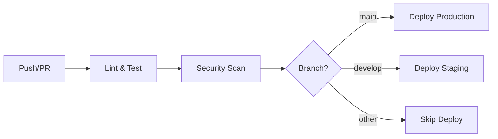

# Wealth - 智能量化分析平台 / Intelligent Quantitative Analysis Platform

<div align="center">


**[English](#english) | [中文](#中文)**

</div>

---

## ✨ 新功能 / New Features v0.4.0

### 🚀 性能优化 / Performance Optimization
- **LRU 缓存系统** - 高效内存缓存，支持 TTL 过期
- **性能监控中间件** - 实时追踪请求耗时
- **自动缓存装饰器** - `@cached` 注解自动缓存函数结果
- **API 性能统计** - `/api/v1/performance/stats` 端点

### 🔄 CI/CD 自动化 / CI/CD Automation
- **GitHub Actions** - 全自动化构建、测试、部署
- **多版本测试** - Python 3.10, 3.11
- **安全扫描** - Bandit + Safety 检查
- **一键部署** - Staging / Production 自动部署
- **Docker 支持** - 容器化镜像构建

### 📊 基准测试 / Benchmark Results
| 操作 | 吞吐量 | 平均耗时 |
|------|--------|----------|
| GET /health | 2,660,991 ops/s | 0.0004 ms |
| cache_get | 157,666 ops/s | 0.0063 ms |
| cache_set | 22,848 ops/s | 0.0438 ms |

---

## 🌟 特性亮点 / Key Features

- ⚡ **实时数据** - 支持 A 股、港股、美股实时行情
- 📊 **量化分析** - MACD、KDJ、RSI、布林带等技术指标
- 🤖 **AI 预测** - LSTM、Prophet、XGBoost 机器学习模型
- 🔒 **安全防护** - 反爬虫、频率限制、数据加密
- 🌐 **双语支持** - 中英文界面一键切换
- 📱 **响应式设计** - 适配桌面端、移动端
- 🚀 **性能优化** - LRU缓存、智能监控、高吞吐量
- 🔄 **CI/CD** - GitHub Actions 全自动化流水线

---

## 📋 功能列表 / Functionality

### 数据采集 / Data Collection
- **AKShare 数据源**: 实时获取 A 股市场数据
- **Yahoo Finance**: 港股、美股数据支持
- **东方财富爬虫**: 基金、债券数据
- **爬虫框架**: 灵活可扩展的数据采集

### 量化分析引擎 / Quantitative Engine
- **技术指标**: MACD、KDJ、RSI、布林带、威廉指标
- **策略回测**: 多策略对比分析，支持参数优化
- **组合管理**: 仓位管理、风险控制

### 机器学习预测 / ML Prediction
- **LSTM 模型**: 深度学习时间序列预测
- **Prophet 模型**: Facebook 开源趋势预测
- **XGBoost 模型**: 梯度提升分类与回归

### 安全防护 / Security
- **反爬虫机制**: 请求频率限制、IP追踪、行为分析
- **数据加密**: AES-256 加密算法
- **RBAC 权限控制**: 角色权限管理

### 性能优化 / Performance
- **多级缓存**: LRU + Timed 双缓存策略
- **请求监控**: 实时性能指标追踪
- **自动优化**: 缓存命中率统计

---

## 🚀 快速开始 / Quick Start

### 环境要求 / Requirements

| 组件 | 版本要求 |
|------|---------|
| Python | 3.10+ |
| Node.js | 18+ |
| npm/yarn | Latest |
| Git | Latest |

### 安装 / Installation

#### Backend

```bash
# Clone repository
git clone https://github.com/badhope/wealth.git
cd wealth

# Install Python dependencies
pip install -r requirements.txt

# Or install individually
pip install loguru fastapi uvicorn pandas numpy akshare httpx pydantic pyecharts yfinance
```

#### Frontend

```bash
cd wealth/frontend
npm install
```

### 启动服务 / Start Services

```bash
# Start backend (port 8000, auto-detects available port)
cd wealth/src
python -m wealth.main

# Start frontend (new terminal)
cd wealth/frontend
npm run dev
```

### 运行测试 / Run Tests

```bash
# Simulation test
cd wealth/scripts
python simulation_test.py

# Performance benchmark
python performance_benchmark.py
```

### Docker 部署 / Docker Deployment

```bash
# Build backend image
docker build -f Dockerfile.backend -t wealth-backend:latest .

# Build frontend image
docker build -f wealth/frontend/Dockerfile -t wealth-frontend:latest .

# Run with docker-compose
docker-compose up -d
```

---

## 📁 项目结构 / Project Structure

```
wealth/
├── .github/
│   └── workflows/
│       └── ci-cd.yml          # GitHub Actions CI/CD
├── src/                         # Backend source
│   └── wealth/
│       ├── api/                # API routes
│       ├── data/               # Data sources
│       ├── engine/             # Quantitative engine
│       ├── ml/                 # Machine learning
│       ├── security/           # Security module
│       ├── utils/              # Utilities (performance.py)
│       ├── vis/                # Visualization
│       └── main.py             # Entry point
├── frontend/                    # Frontend source
│   └── src/
│       ├── api/                # API calls
│       ├── assets/             # Styles
│       ├── components/         # UI components
│       ├── i18n/               # Internationalization
│       ├── router/             # Routes
│       └── views/              # Pages
├── scripts/                     # Scripts
│   ├── simulation_test.py     # Simulation tests
│   └── performance_benchmark.py # Performance benchmarks
├── docs/                        # Documentation
│   ├── API_PROTOCOL.md         # API documentation
│   ├── CONTRIBUTING.md         # Contributing guide
│   └── CODE_OF_CONDUCT.md      # Code of conduct
└── data/                       # Data directory
```

---

## 🔌 API 接口 / API Reference

完整 API 文档: [API_PROTOCOL.md](docs/API_PROTOCOL.md)

### 核心端点 / Core Endpoints

| Method | Endpoint | Description |
|--------|----------|-------------|
| GET | `/api/v1/health` | Health check with performance stats |
| GET | `/api/v1/security/stats` | Security monitoring stats |
| GET | `/api/v1/performance/stats` | Performance metrics |
| GET | `/api/v1/performance/cache/clear` | Clear cache |
| POST | `/api/v1/stocks/quote/realtime` | Real-time quote |
| POST | `/api/v1/stocks/kline` | K-line data |
| POST | `/api/v1/indicators/calculate` | Calculate indicators |
| POST | `/api/v1/backtest/run` | Run backtest |
| POST | `/api/v1/strategy/list` | Strategy list |
| GET | `/api/v1/funds/list` | Fund list |
| POST | `/api/v1/prediction/predict` | AI prediction |

### 性能端点 / Performance Endpoints

```bash
# Get system performance stats
curl http://localhost:8000/api/v1/performance/stats

# Clear cache
curl http://localhost:8000/api/v1/performance/cache/clear

# Health check with stats
curl http://localhost:8000/api/v1/health
```

响应示例:
```json
{
  "status": "healthy",
  "version": "0.4.0",
  "uptime_seconds": 3600.5,
  "security": {...},
  "performance": {
    "total_requests": 15000,
    "cache_stats": {
      "request_stats": {
        "hit_rate": "85.32%"
      }
    }
  }
}
```

---

## 🌐 国际化 / Internationalization

Wealth 支持中英文双语界面，可通过顶部导航栏的语言切换按钮一键切换。

**Language Support**: English | 中文

### 切换语言 / Switching Language

1. 点击导航栏右侧的语言切换按钮
2. 选择 English 或 中文
3. 界面将自动刷新为所选语言

---

## 📖 使用指南 / User Guide

### 搜索股票 / Search Stocks

1. 在搜索框输入股票代码（如 `000001`）
2. 点击搜索或按回车键
3. 查看实时行情、K线图、技术指标

### 运行回测 / Run Backtest

1. 进入回测页面
2. 选择股票代码、策略类型、日期范围
3. 点击"运行回测"按钮
4. 查看回测结果和绩效指标

### AI 预测 / AI Prediction

1. 进入预测页面
2. 选择股票和预测模型
3. 设置预测时间范围
4. 查看预测结果和置信度

---

## 🛠️ 技术栈 / Tech Stack

### Backend
| Technology | Purpose |
|------------|---------|
| FastAPI | Web framework |
| Pandas | Data processing |
| NumPy | Numerical computing |
| AKShare | Financial data |
| PyEcharts | Chart generation |
| TensorFlow | Deep learning |
| XGBoost | Gradient boosting |

### Frontend
| Technology | Purpose |
|------------|---------|
| Vue 3 | UI framework |
| Vite | Build tool |
| ECharts | Charts |
| Pinia | State management |
| Vue Router | Routing |
| Vue I18n | Internationalization |

### DevOps
| Technology | Purpose |
|------------|---------|
| GitHub Actions | CI/CD pipeline |
| Docker | Containerization |
| Bandit | Security linting |
| Safety | Dependency check |

---

## 📊 页面预览 / Screenshots

| Page | Description |
|------|-------------|
| 首页 | 市场概览、快捷入口 |
| 股票 | 搜索、详情、图表 |
| 基金 | 列表、净值、筛选 |
| 回测 | 策略配置、绩效分析 |
| 预测 | ML 模型、趋势预测 |
| 监控 | 系统状态、安全告警 |

---

## 📚 文档 / Documentation

- [API Protocol](docs/API_PROTOCOL.md) - Complete API documentation
- [Contributing Guide](docs/CONTRIBUTING.md) - How to contribute
- [Code of Conduct](docs/CODE_OF_CONDUCT.md) - Community guidelines

---

## 🤝 贡献 / Contributing

Contributions are welcome! Please read our [Contributing Guide](docs/CONTRIBUTING.md) before submitting changes.

1. Fork the repository
2. Create your feature branch (`git checkout -b feature/AmazingFeature`)
3. Commit your changes (`git commit -m 'feat: Add some AmazingFeature'`)
4. Push to the branch (`git push origin feature/AmazingFeature`)
5. Open a Pull Request

---

## 🔄 CI/CD 工作流 / CI/CD Workflow

### 自动触发 / Auto Triggers

| Event | Action |
|-------|--------|
| Push to `main` | Run tests, build, deploy to production |
| Push to `develop` | Run tests, build, deploy to staging |
| Pull Request | Run tests, lint, security scan |
| Manual | Run benchmark, build Docker images |

### 工作流程 / Workflows



---

## 📄 License

This project is licensed under the MIT License - see the [LICENSE](LICENSE) file for details.

---

## 🙏 致谢 / Acknowledgments

- [AKShare](https://github.com/akfamily/akshare) - 金融数据源
- [PyEcharts](https://github.com/pyecharts/pyecharts) - Python 图表库
- [ECharts](https://github.com/apache/echarts) - 数据可视化库
- [Vue-Echarts](https://github.com/ecomfe/vue-echarts) - Vue 图表组件
- [Vue I18n](https://github.com/intlify/vue-i18n) - 国际化解决方案

---

<div align="center">

**Made with ❤️ by [badhope](https://github.com/badhope)**

[](https://github.com/badhope/wealth/stargazers)
[](https://github.com/badhope/wealth/network/members)

</div>

---

## 中文

### 项目简介

Wealth 是一个专业的智能量化分析平台，致力于为投资者提供全面的股票、基金等金融产品分析工具。

### 主要功能

1. **实时行情** - 支持多个市场和多种资产类别
2. **技术分析** - 多种技术指标和图表工具
3. **策略回测** - 验证交易策略的有效性
4. **AI 预测** - 基于机器学习的价格预测
5. **风险管理** - 组合管理和风险控制
6. **预警通知** - 自定义规则和实时通知
7. **性能优化** - 多级缓存、高吞吐量
8. **CI/CD** - 全自动化部署流水线

### 安装步骤

1. 克隆仓库: `git clone https://github.com/badhope/wealth.git`
2. 安装 Python 依赖: `pip install -r requirements.txt`
3. 安装前端依赖: `cd frontend && npm install`
4. 启动后端: `cd src && python -m wealth.main`
5. 启动前端: `cd frontend && npm run dev`

### 运行测试

```bash
# 模拟测试
cd wealth/scripts
python simulation_test.py

# 性能基准测试
python performance_benchmark.py
```

### CI/CD

项目已配置 GitHub Actions，每次 push 到 main 分支会自动：
1. 运行后端和前端测试
2. 执行安全扫描
3. 构建 Docker 镜像
4. 部署到生产环境

### 技术支持

如有问题，请提交 Issue 或联系维护者。

### 更新日志

#### v0.4.0
- 添加性能优化模块（LRU缓存、性能监控）
- 添加 GitHub Actions CI/CD 流水线
- 添加性能基准测试脚本
- 添加 Docker 构建支持
- 优化前端构建配置（vendor分包、压缩）
- 添加新的API端点（性能统计、缓存管理）

#### v0.3.0
- 添加中英文双语支持
- 新增多个 UI 组件
- 优化响应式设计
- 添加更多文档

#### v0.2.0
- 添加机器学习预测模型
- 实现安全防护模块
- 完善回测引擎

#### v0.1.0
- 初始版本
- 基础功能实现
